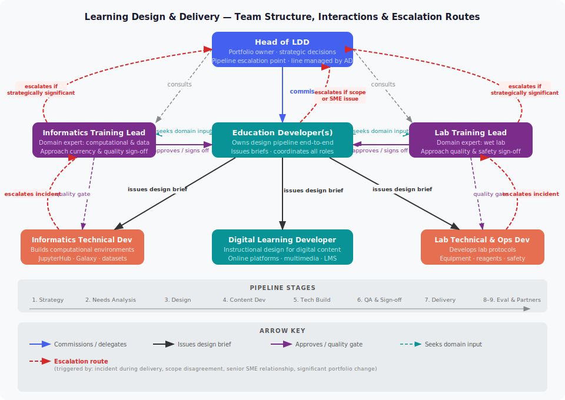

# Team Structure & Interactions

The diagram below shows how the roles in the Learning Design & Delivery team relate to each other across the shared pipeline — including normal working relationships and escalation routes.

---

---

## How to read this diagram

Normal working relationships flow **downward** — from strategic decisions at the top, through design coordination in the middle, to technical build at the bottom.

Escalation routes (red dashed arrows) flow **upward** and are only triggered in specific circumstances:

- **Technical Developers → Training Leads** — when an incident occurs during delivery (e.g. environment fails, practical goes wrong). The Technical Developer fixes the technical problem; the Training Lead manages the learner situation and decides how to proceed.
- **Training Leads → Head of LDD** — when a stakeholder ask is strategically significant, or a scope disagreement cannot be resolved at team level.
- **Education Developer → Head of LDD** — when an SME relationship is senior or politically sensitive, or when a scope issue on a design brief cannot be resolved.

For the full detail on each role's responsibilities at each stage, see the [Pipeline Stages](../stages/stage-1.md).
